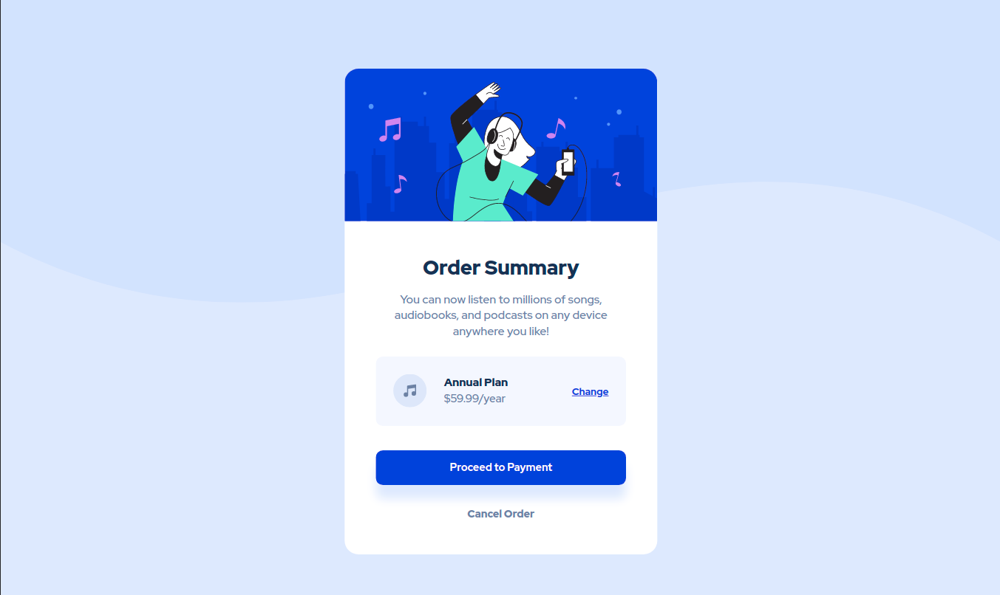

# Frontend Mentor - Order summary card solution

This is a solution to the [Order summary card challenge on Frontend Mentor](https://www.frontendmentor.io/challenges/order-summary-component-QlPmajDUj). Frontend Mentor challenges help you improve your coding skills by building realistic projects. 

## Table of contents

- [Overview](#overview)
  - [The challenge](#the-challenge)
  - [Screenshot](#screenshot)
  - [Links](#links)
- [My process](#my-process)
  - [Built with](#built-with)
  - [What I learned](#what-i-learned)
  - [Continued development](#continued-development)
- [Author](#author)

## Overview

### The challenge

Users should be able to:

- See hover states for interactive elements

### Screenshot

### Links

- Solution URL: https://mlzzi.github.io/order-summary-component/

## My process

### Built with

- HTML5 basics
- CSS custom properties

### What I learned

This is one of my first projects builded with CSS and HTML. The challenge is from Front End Mentor, and it maked me solify the knowledges that I'm learning by the courses I've been made.
I've used basics CSS and HTML.

### Continued development

My next steps is to learn Flexbox and Grid to aplly them in future projects.
In the future I want to start to use Javascript in more complex challenges.

## Author

- Linkedin - https://www.linkedin.com/in/muriloluzzi/
- Frontend Mentor - [@mlzzi](https://www.frontendmentor.io/profile/mlzzi)

